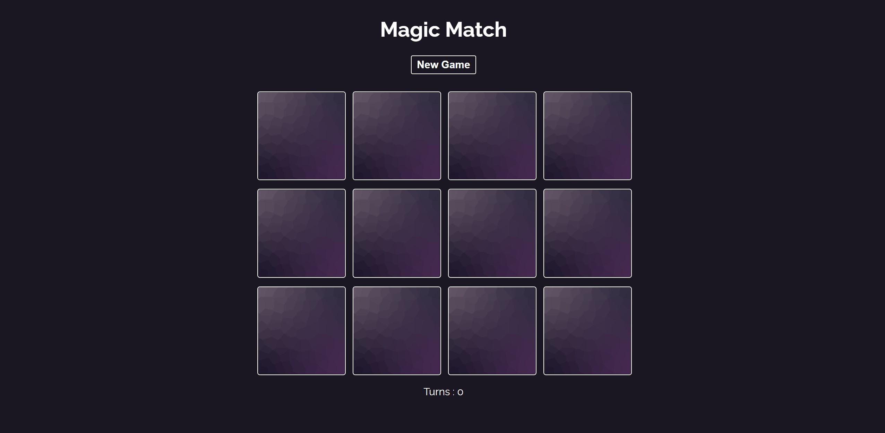
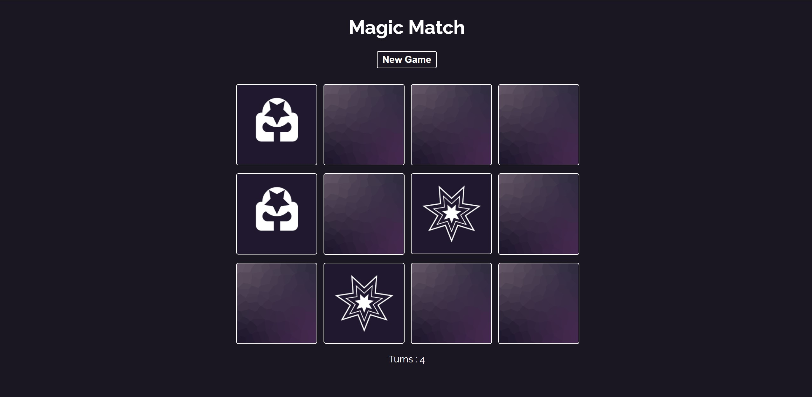

## Dmitry Sinyavskiy Memory game on ReactJS

https://memory-game-react-uch2ha.netlify.app

### Installation

1. Install NPM packages

```sh
  npm install
```

2. Start the application

```sh
  npm start
```

## Functionalities and Usage

-   The game starts with all the cards face down. You need to find all duplicates of cards





